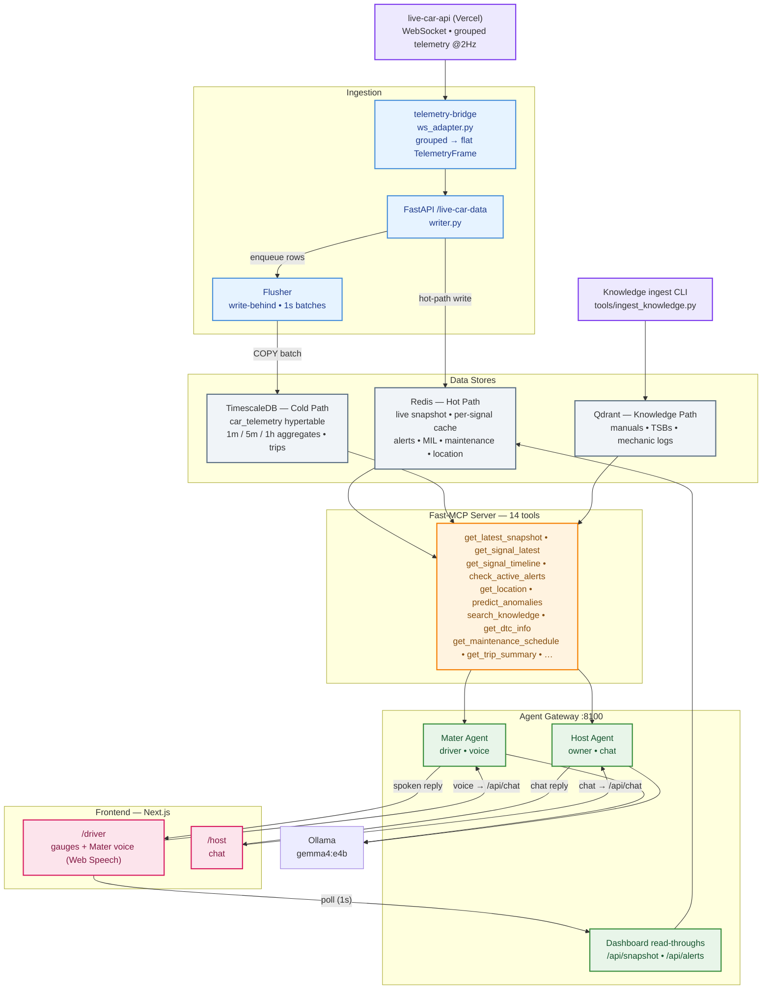

# Mater

A real-time, voice-first vehicle assistant. Live OBD telemetry flows through a
Redis hot path and a TimescaleDB cold path; manuals/TSBs/mechanic logs live in
Qdrant. Two LangGraph agents — **Mater** (driver, voice) and **Host** (owner,
chat) — reach all of it through a single Fast-MCP tool layer backed by a local
Ollama LLM.

# High Level Architecture



## Layout

```text
/db/init.sql       TimescaleDB schema: hypertable, continuous aggregates,
                   compression + retention, supplementary tables, signal registry
/backend
  /common          config, store clients, Redis key schema, models, rules, Qdrant
  /ingestion       FastAPI `/live-car-data` + write-behind flusher  (port 8000)
  /mcp_server      Fast-MCP server with the 13 tools                (port 8765)
  /agent           LangGraph Mater + Host agents + HTTP gateway      (port 8100)
  /tools           knowledge-ingestion CLI + telemetry simulator
/frontend          Next.js dashboard (gauges) + chat                (port 3000)
docker-compose.yml all services + Redis / TimescaleDB / Qdrant / Ollama
```

## Quick start

```bash
docker compose up -d --build          # bring up everything

# Pull the LLM into Ollama (one time)
docker exec mater_ollama ollama pull gemma4:e4b

```

Then open the dashboard at <http://localhost:3000>. Gauges update once per
second from the Redis snapshot; the chat panel talks to the Host/Mater agents.

### Ports

| Service     | URL                                 | Purpose                |
| ----------- | ----------------------------------- | ---------------------- |
| Ingestion   | http://localhost:8000/live-car-data | Telemetry write path   |
| MCP server  | http://localhost:8765/mcp           | 13-tool layer          |
| Agent API   | http://localhost:8100/api/chat      | Chat + dashboard reads |
| Frontend    | http://localhost:3000               | Dashboard + chat       |
| TimescaleDB | localhost:5432                      | Cold path              |
| Qdrant      | http://localhost:6333               | Knowledge path         |
| Redis       | localhost:6379                      | Hot path               |
| Ollama      | http://localhost:11434              | LLM engine             |

## Ingest knowledge (RAG)

```bash
python backend/tools/ingest_knowledge.py \
    --car-id acc001 --model Accord --source manual --system engine \
    path/to/accord_manual.txt
```

## Local dev (stores in Docker, backend on host)

```bash
cd backend
python -m venv .venv && source .venv/bin/activate
pip install -r requirements.txt
docker compose up -d timescaledb redis qdrant ollama   # stores only

uvicorn ingestion.app:app --reload --port 8000   # terminal 1
python -m mcp_server.server                       # terminal 2
uvicorn agent.api:app --reload --port 8100        # terminal 3
```

## Notes / scope

* **Audio** (whisper.cpp ASR, VoXtream2 TTS, wake-word) is device/native and is
  not bundled here — the Mater agent exposes a text `/api/chat` surface that a
  voice front-end would wrap.
* `gemma4:e4b` is the default Ollama tag; set `LLM_MODEL` to the exact
  gemma4:e4b build you run.
* The backend is one image with multiple entrypoints (ingestion / mcp / agent),
  keeping the shared `common` code DRY.
